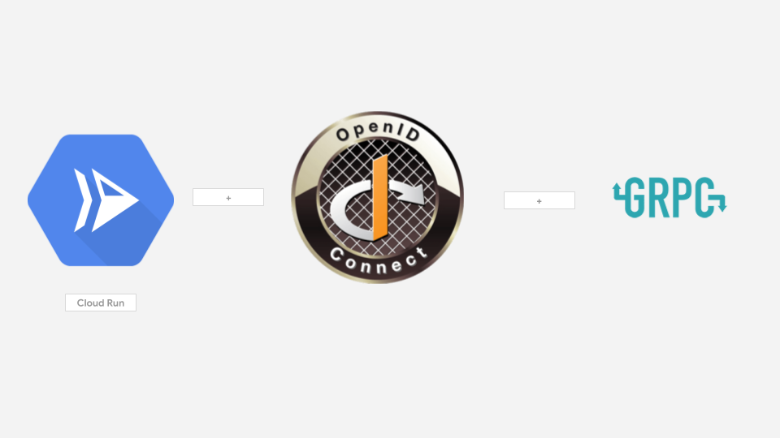

# gRPC Authentication with Cloud Run

A couple months back I was happy to assist the [Cloud Run](https://cloud.google.com/run/) (managed) team in validating gRPC support on that platform.  The testing/validation covered writing a simple deployable gRPC client and server that also performed OpenIDConnect (OIDC) Authentication over gRPC (i.,e. Cloud Run Authentication).   In the course of developing that, i gained an understanding of how gRPC authentication headers are handled and manged directly with gRPC.   This article explains how to connect to a secure gRPC service running on Cloud Run using native gRPC library constructs.

The links cited in the Reference section discusses gRPC on Cloud Run but these do not cover either authentication at all or do not specify authentication using gRPC-centric constructs with Google Cloud Auth client libraries.

This article covers a simple client-server you can deploy on Cloud run that includes gRPC authentication _using google cloud credentials_ .   We specifically use `ServiceAccount Credentials` but the library cited below will work while running on GCE, GKE or even on Cloud RUn itself.



---

### OIDC Basics for GCP Services and gRPC

This article does not go into details about OpenID Connect tokens and how to use them with gRPC and GCP.  As background please see

- [https://github.com/salrashid123/grpc_google_id_tokens](https://github.com/salrashid123/grpc_google_id_tokens)
- [Authenticating using Google OpenID Connect Tokens](https://medium.com/google-cloud/authenticating-using-google-openid-connect-tokens-e7675051213b)
- ["google.golang.org/api/idtoken"](https://pkg.go.dev/google.golang.org/api@v0.23.0/idtoken)  << use this!

You can inject a TokenSource into a grpc call by aupplyinng it into `grpc.WithPerRPCCredentials()`, thats it:

```golang
import "google.golang.org/api/idtoken"
...
...
	idTokenSource, err := idtoken.NewTokenSource(ctx, targetAudience, idtoken.WithCredentialsFile(serviceAccount))

	tok, err := idTokenSource.Token()

    ce := credentials.NewTLS(&tlsCfg)
		conn, err = grpc.Dial(*address,
			grpc.WithTransportCredentials(ce),
			grpc.WithPerRPCCredentials(
				oauth.TokenSource{
					idTokenSource,
				}),
		)
```

> For equivalent samples in other languages see [gRPC Authentication with Google OpenID Connect tokens](https://github.com/salrashid123/grpc_google_id_tokens).

Anyway, lets go directly into the details on deploying to cloud run

I'm assuming you have Cloud Run setup and relatively above with gRPC and the auth concepts cited above


#### Setup Env Vars 

```bash
    export PROJECT_ID=`gcloud config get-value core/project`
    gcloud config set run/region us-central1
    gcloud config set run/platform managed
```

#### Build and deploy gRPC Server Image

The fofllowing assume you an cloud run can access artifact registry `us-central1-docker.pkg.dev/$PROJECT_ID/repo1/`
```bash
    docker build -t us-central1-docker.pkg.dev/$PROJECT_ID/repo1/grpc_run_serve -f Dockerfile.server .
    
    docker push us-central1-docker.pkg.dev/$PROJECT_ID/repo1/grpc_run_serve 
    gcloud run deploy grpc --image us-central1-docker.pkg.dev/$PROJECT_ID/repo1/grpc_run_serve  --no-allow-unauthenticated
```

#### Create Client SA

Now create the service account that will have access to invoke the Cloud Run service

```bash
    mkdir -p certs
    gcloud iam service-accounts create grpc-client-account --display-name "gRPC Client Service Account"
    gcloud iam service-accounts keys create certs/grpc_client.json --iam-account=grpc-client-account@$PROJECT_ID.iam.gserviceaccount.com
```

#### Set IAM Permission for `roles/run.invoker`:

```bash
cat <<EOT >> iam_policy.json
bindings:
- members:
  - serviceAccount:grpc-client-account@$PROJECT_ID.iam.gserviceaccount.com
  role: roles/run.invoker
version: 1
EOT

gcloud run services set-iam-policy grpc iam_policy.json 
```

## Build Client

At this point, the gRPC service is secure by default and would require an OIDC token with the correct `audience` field and IAM permissions to get through

The audience filed for cloud run needs to be the fully qualified name with the protocol (custom domain aud fields is currently not supported)

```bash
    export AUDIENCE=`gcloud run services describe grpc --format="value(status.url)"`
    export ADDRESS=`echo $AUDIENCE |  awk -F[/:] '{print $4}'`
    echo $AUDIENCE
    echo $ADDRESS
```


## RUN gRPC Client

Now run the grpc client and specify the serviceAccount json file that is mounted inside the container (note: you should cd to the root of this repo so that the path to `certs/` is mounted):


``bash
go run src/grpc_client.go \
  --address $ADDRESS:443 --usetls=true  \
  --servername $ADDRESS --audience $AUDIENCE \
  --serviceAccount certs/grpc_client.json
```

The output of `grpc_run_client` will show the OIDC token sent to the cloud run instance which you can decode at [jwt.io](jwt.io).  Note the `aud:`, `email` and `iss` fields 

```json
{
  "iss": "https://accounts.google.com",
  "aud": "https://grpc-6w42z6vi3q-uc.a.run.app",
  "azp": "grpc-client-account@mineral-minutia-820.iam.gserviceaccount.com",
  "sub": "101659512549165144150",
  "email": "grpc-client-account@mineral-minutia-820.iam.gserviceaccount.com",
  "email_verified": true,
  "iat": 1572983749,
  "exp": 1572987349
}
```

The second portion is 5 unary responses back from the GRPC service that displays the `K_REVISION` env variable from Cloud RUn

```log
2019/11/05 20:52:14 RPC Response: 0 message:"Hello unary RPC msg   from K_REVISION grpc-tnslx" 
2019/11/05 20:52:15 RPC Response: 1 message:"Hello unary RPC msg   from K_REVISION grpc-tnslx" 
2019/11/05 20:52:16 RPC Response: 2 message:"Hello unary RPC msg   from K_REVISION grpc-tnslx" 
2019/11/05 20:52:17 RPC Response: 3 message:"Hello unary RPC msg   from K_REVISION grpc-tnslx" 
2019/11/05 20:52:18 RPC Response: 4 message:"Hello unary RPC msg   from K_REVISION grpc-tnslx" 
```

The final output is a buffered form Server-side Streaming messages back (i.,e the server sends back two responses back on the single request).
At the time of writing `11/5/19`, server streaming is _not_ officially supported as its not true streaming but a buffered response anyway 

```log
2019/11/05 20:52:18 Stream Header: %!(EXTRA metadata.MD=map[alt-svc:[quic=":443"; ma=2592000; v="46,43",h3-Q049=":443"; ma=2592000,h3-Q048=":443"; ma=2592000,h3-Q046=":443"; ma=2592000,h3-Q043=":443"; ma=2592000] content-type:[application/grpc] streamheaderkey:[val] x-cloud-trace-context:[7928b8ab5aa6b2dc759ca6ff7fa5bb4c] date:[Tue, 05 Nov 2019 20:52:19 GMT] server:[Google Frontend] content-length:[52]])

2019/11/05 20:52:18 Message: %!(EXTRA string=Msg1 Stream RPC msg)

2019/11/05 20:52:18 Stream Header: %!(EXTRA metadata.MD=map[date:[Tue, 05 Nov 2019 20:52:19 GMT] server:[Google Frontend] content-length:[52] alt-svc:[quic=":443"; ma=2592000; v="46,43",h3-Q049=":443"; ma=2592000,h3-Q048=":443"; ma=2592000,h3-Q046=":443"; ma=2592000,h3-Q043=":443"; ma=2592000] content-type:[application/grpc] streamheaderkey:[val] x-cloud-trace-context:[7928b8ab5aa6b2dc759ca6ff7fa5bb4c]])

2019/11/05 20:52:18 Message: %!(EXTRA string=Msg2 Stream RPC msg)

2019/11/05 20:52:18 Stream Trailer:  map[]
```


enjoy grpc-ing!


### References
- Cloud Run
  - [Serverless gRPC with Cloud Run](https://medium.com/@petomalina/%EF%B8%8Fserverless-grpc-with-cloud-run-bab3622a47da)
  - [gRPC Authentication on Cloud Run](https://ahmet.im/blog/grpc-auth-cloud-run/)

- Misc
  - [Calling Cloud Composer to Cloud Functions and back again, securely](https://medium.com/google-cloud/calling-cloud-composer-to-cloud-functions-and-back-again-securely-8e65d783acce)
  - [Automatic OIDC: Using Cloud Scheduler, Tasks, and PubSub to make authenticated calls to Cloud Run, Cloud Functions or your Server](https://medium.com/google-cloud/automatic-oidc-using-cloud-scheduler-tasks-and-pubsub-to-make-authenticated-calls-to-cloud-run-de9e7e9cec3f)

  - [Authorizing access to Cloud Run for Anthos deployed on GKE services using Istio](https://cloud.google.com/solutions/authorizing-access-to-cloud-run-on-gke-services-using-istio)
  - [Authenticating end users of Cloud Run for Anthos deployed on GKE services using Istio and Identity Platform](https://cloud.google.com/solutions/authenticating-cloud-run-on-gke-end-users-using-istio-and-identity-platform)

### Appendix


